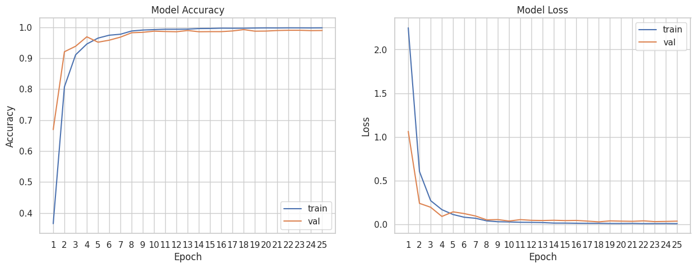
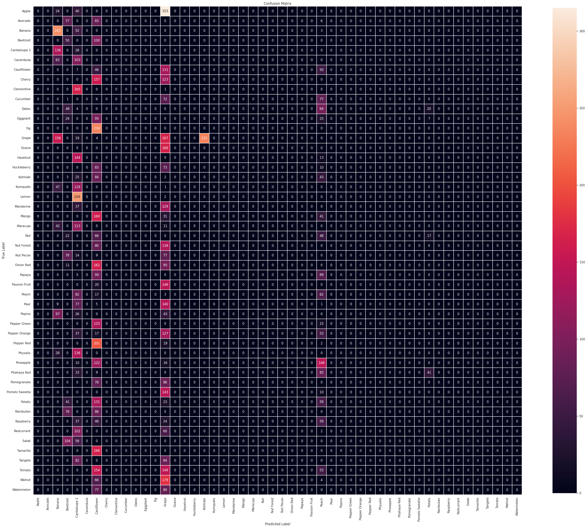
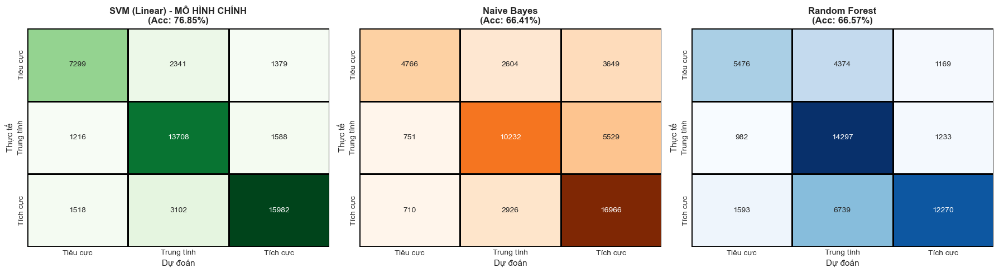

# 🔬 Applied Machine Learning & Empirical Benchmarks: Computer Vision & NLP

[](https://www.python.org/)
[](https://tensorflow.org/)
[](https://scikit-learn.org/)
[](docs/Technical_Report.pdf)
[](https://opensource.org/licenses/MIT)
[](https://colab.research.google.com/github/nguyengiathanh1203/fruit-cv-and-sentiment-analysis-nlp/blob/main/notebooks/Fruit_Classification.ipynb)
[](https://colab.research.google.com/github/nguyengiathanh1203/fruit-cv-and-sentiment-analysis-nlp/blob/main/notebooks/Sentiment_Analysis.ipynb)

An empirical study and comparative benchmarking suite investigating input representations and machine learning architectures across two domain tasks:
- **Computer Vision:** A custom multi-channel CNN leveraging **HSV + Grayscale input fusion** on low-resolution agricultural data (**Fruits-360**), benchmarked against standard transfer learning backbones (**DenseNet121**, **ResNet50**, **EfficientNetB0**).
- **Natural Language Processing:** Large-scale sentiment classification on 240,000+ texts comparing sparse representations (**TF-IDF**) with **Linear SVM**, **Multinomial Naive Bayes**, and **Random Forest**.

> 📄 **Technical Report:** The complete academic paper and experimental analysis is available at [`docs/Technical_Report.pdf`](docs/Technical_Report.pdf).

---

## 📌 Table of Contents
- [1. Key Empirical Findings](#1-key-empirical-findings)
- [2. Repository Structure](#2-repository-structure)
- [3. Topic 1: Fruit Classification (Computer Vision)](#3-topic-1-fruit-classification-computer-vision)
  - [3.1. Methodology & Pipeline Design](#31-methodology--pipeline-design)
  - [3.2. Custom CNN Architecture & Hyperparameters](#32-custom-cnn-architecture--hyperparameters)
  - [3.3. Empirical Benchmark & Error Analysis](#33-empirical-benchmark--error-analysis)
- [4. Topic 2: Sentiment Classification (NLP)](#4-topic-2-sentiment-classification-nlp)
  - [4.1. Dataset & Text Preprocessing](#41-dataset--text-preprocessing)
  - [4.2. Comparative Results & Model Selection](#42-comparative-results--model-selection)
- [5. Execution & Reproducibility](#5-execution--reproducibility)
- [6. Author & Academic Context](#6-author--academic-context)
- [7. References](#7-references)
---

## 1. Key Empirical Findings
- **Domain-Tailored CNN vs. Deep Backbones:** On low-resolution images ($100 \times 100$), the proposed lightweight 4-channel Custom CNN achieved **98.5%** accuracy, outperforming heavy transfer learning architectures like ResNet50 (64.2%) and EfficientNetB0 (41.0%), which suffered from rapid spatial downsampling and receptive field mismatch.
- **Multimodal Channel Fusion:** Concatenating HSV (illumination invariance) and Grayscale (spatial/texture gradients) into a 4-channel tensor accelerated early convergence, achieving stable loss ($\text{Loss} < 0.1$) within 10 epochs.
- **High-Dimensional Text Classification:** Linear SVM demonstrated superior margin stability (**76.85%** accuracy, balanced class-weighted F1-score) over probabilistic (Naive Bayes, 66.41%) and ensemble methods (Random Forest, 66.57%) in sparse n-gram spaces.

---

## 2. Repository Structure

```text
├── docs/
│   └── Technical_Report.pdf   # Complete course report & academic documentation
├── notebooks/               # Reproducible end-to-end pipeline: CV & NLP
│   ├── Fruit_Classification.ipynb
│   └── Sentiment_Analysis.ipynb      
├── results/
│   ├── fruit_confusion_matrix.png         # Multi-class confusion matrix for Fruits-360
│   ├── fruit_training_curves.png          # Loss and accuracy curves for Custom CNN
│   └── sentiment_confusion_matrix.png     # Error distribution across sentiment classes
├── requirements.txt                       # Environment dependencies
└── README.md                              # Project documentation
```
---
## 3. Topic 1: Fruit Classification (Computer Vision)

### 3.1. Methodology & Pipeline Design
* **Dataset:** [Fruits-360 (v28)](https://www.kaggle.com/datasets/moltean/fruits/versions/28) by Mihai Oltean, comprising 37,833 images across 100+ categories (27,655 training samples and 10,178 testing samples).
* **4-Channel Input Fusion:** Raw RGB images ($100 \times 100$) are transformed into HSV and Grayscale color representations, then concatenated into a unified $100 \times 100 \times 4$ input tensor:
  $$\mathbf{X}_{\text{fused}} = \text{Concat}(\mathbf{X}_{\text{HSV}}, \mathbf{X}_{\text{Gray}}) \in \mathbb{R}^{100 \times 100 \times 4}$$
  * **HSV Channels (3 channels):** Enhances model invariance against environmental lighting and variable brightness conditions.
  * **Grayscale Channel (1 channel):** Retains structural edges, geometric silhouettes, and surface texture patterns.
* **Throughput Optimization:** Input tensors are serialized into binary **TFRecords** format to eliminate CPU-GPU I/O bottlenecks during training.
* **Data Augmentation:** Scaled to $[0, 1]$ with random hue adjustments ($0.9 - 1.2$), saturation shifts ($\pm 0.2$), and random horizontal/vertical flips.

### 3.2. Custom CNN Architecture & Hyperparameters
The dedicated network consists of 4 convolutional blocks followed by fully connected dense layers:

```text
Input: [100 x 100 x 4] (HSV + Grayscale)
  │
  ├── [Conv Block 1] Conv2D (16 filters, 5x5, ReLU) ──► MaxPool2D (2x2, stride 2) ──► Out: [50x50x16]
  │
  ├── [Conv Block 2] Conv2D (32 filters, 5x5, ReLU) ──► MaxPool2D (2x2, stride 2) ──► Out: [25x25x32]
  │
  ├── [Conv Block 3] Conv2D (64 filters, 5x5, ReLU) ──► MaxPool2D (2x2, stride 2) ──► Out: [13x13x64]
  │
  ├── [Conv Block 4] Conv2D (128 filters, 5x5, ReLU) ──► MaxPool2D (2x2, stride 2) ──► Out: [7x7x128]
  │
  ├── Flatten Layer
  ├── Dense Layer 1: 1024 units (ReLU activation)
  ├── Dense Layer 2: 256 units (ReLU activation)
  └── Output Layer: Softmax Activation (Multi-class probability distribution)
```
---
### 3.3. Empirical Benchmark & Error Analysis

#### Quantitative Performance Comparison
Experiments were conducted on the 10,178 unseen test images across all competitive architectures:

| Architecture | Input Dimensions | Training Strategy | Test Accuracy (%) | Convergence & Efficiency |
| :--- | :---: | :---: | :---: | :--- |
| **Custom CNN (Proposed)** | $100 \times 100 \times 4$ | Train from scratch (Fused HSV+Gray) | **~98.5%** | Rapid convergence by epoch 10; categorical loss dropped below 0.1 |
| **DenseNet121** | $100 \times 100 \times 3$ | Transfer Learning | **~97.8%** | High feature reuse via dense connectivity |
| **ResNet50** | $100 \times 100 \times 3$ | Transfer Learning | ~64.2% | Suboptimal representation due to early spatial stride reduction |
| **EfficientNetB0** | $100 \times 100 \times 3$ | Transfer Learning | ~41.0% | Severe generalization degradation on low-resolution scale |

#### Convergence Dynamics
The validation accuracy and loss trajectories closely tracked the training curves throughout 25 epochs, exhibiting smooth convergence without signs of overfitting or gradient instability.



#### Confusion Matrix & Error Diagnosis
Predictions displayed strong diagonal concentration across the majority of categories. Misclassifications were isolated to pairs exhibiting high chromatic and geometric similarities (*Lemon* vs. *Limes*, *Beets* vs. *Apple/Blackberry*).



---

## 4. Topic 2: Sentiment Classification (NLP)

### 4.1. Dataset & Text Preprocessing
* **Dataset:** The benchmark *Sentiment Analysis Dataset* by Abdelmalek Eladjelet containing 241,145 user reviews.
* **Label Distribution:**
  * **Positive:** 103,059 samples (42.5%)
  * **Neutral:** 82,972 samples (34.4%)
  * **Negative:** 55,114 samples (22.9%)
* **Data Splits:** 80% for training (192,528 samples) and 20% for testing (48,133 samples).
* **Text Normalization:** Lowercasing, regex-based removal of URLs, email handles, punctuation, special symbols, redundant whitespaces, and standard Unicode normalization.
* **Feature Representation (TF-IDF):** Extracted via `TfidfVectorizer` capped at the top 3,000 features, leveraging unigrams and bigrams (`ngram_range=(1, 2)`), `min_df=5`, and `max_df=0.8`.
* **Class Imbalance Strategy:** Configured `class_weight='balanced'` to dynamically penalize misclassification on minority classes (e.g., negative reviews).

### 4.2. Comparative Results & Model Selection
Evaluation on 48,133 unseen test reviews across classic statistical and ensemble classifiers:

| Classifier | Feature Representation | Test Accuracy (%) | Empirical Insights |
| :--- | :---: | :---: | :--- |
| **Linear SVM (Proposed)** | TF-IDF (3,000 features) | **76.85%** | Optimal separating margin in high-dimensional sparse space; balanced class-level F1-scores |
| **Random Forest** | TF-IDF (3,000 features) | 66.57% | Sub-optimal axis-aligned partitioning over continuous sparse vectors |
| **Multinomial Naive Bayes** | TF-IDF (3,000 features) | 66.41% | High training speed, but independence assumption degrades recall on subtle/negative reviews |

#### Lexical Importance & Error Distribution
Feature coefficient extraction from Linear SVM identified high-impact predictive tokens aligning with polar sentiments: positive (*good*, *great*, *love*, *best*) versus negative (*poor*, *bad*, *hate*, *wrong*).



## 5. Execution & Reproducibility

### 5.1. Run Online in Google Colab (1-Click Execution)
* 🍎 [Launch Fruit Classification in Colab](https://colab.research.google.com/github/nguyengiathanh1203/fruit-cv-and-sentiment-analysis-nlp/blob/main/notebooks/Fruit_Classification.ipynb)
* 📝 [Launch Sentiment Analysis in Colab](https://colab.research.google.com/github/nguyengiathanh1203/fruit-cv-and-sentiment-analysis-nlp/blob/main/notebooks/Sentiment_Analysis.ipynb)

### 5.2. Local Environment Setup

```bash
# Clone the repository
git clone https://github.com/nguyengiathanh1203/fruit-cv-and-sentiment-analysis-nlp.git
cd fruit-cv-and-sentiment-analysis-nlp

# Create environment (Python 3.10+)
python -m venv venv

# Activate environment
# On Linux/macOS:
source venv/bin/activate
# On Windows:
venv\Scripts\activate

# Install dependencies
pip install --upgrade pip
pip install -r requirements.txt

# Launch JupyterLab
jupyter lab
```

---

## 6. Author & Academic Context

* **Primary Author:** **Nguyen Gia Thanh**
  * Department of Information Technology, Saigon University (SGU)
  * Major: Artificial Intelligence
  * Contributions: Research methodology, 4-channel image fusion pipeline, binary TFRecords serialization, Custom CNN architecture design, TF-IDF feature engineering, multi-model empirical benchmarking, and comprehensive technical documentation.
* **Co-author:** Thai Minh Tam (Saigon University) – Data collation and baseline verification.
* **Course:** Data Mining and Applications
* **Advisor / Course Instructor:** Nguyen Thanh Phuoc

---

## 7. References

1. H. Mureşan and M. Oltean, *"Fruit recognition from images using deep learning,"* Acta Univ. Sapientiae, Informatica, vol. 10, no. 1, pp. 26–42, 2018.
2. Frida Femling, Adam Olsson, Fernando Alonso-Fernandez, “Fruit and Vegetable Identification Using Machine Learning for Retail Applications”, arXiv:1810.09811v1 [cs.CV] 23 Oct 2018.
3. F. Femling, A. Olsson, and F. Alonso-Fernandez, *"Fruit and Vegetable Identification Using Machine Learning for Retail Applications,"* arXiv:1810.09811, 2018.
4. J. Brownlee, *"Machine Learning Mastery With Python: Understand Your Data, Create Accurate Models and Work Projects End-To-End,"* Melbourne, VIC, Australia, 2016.
5. M. Abbas, A. Kamran, Memon, A. A. Jamali, Saleemullah Memon, and Anees Ahmed, *"Multinomial Naive Bayes Classification Model for Sentiment Analysis,"* 2019.
6. D. Zheng, *"Sentiment Analysis for Film Reviews Based on Random Forest,"* Sci. Technol. Eng. Chem. Environ. Prot., vol. 1, no. 7, June 2024.
